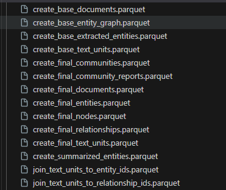
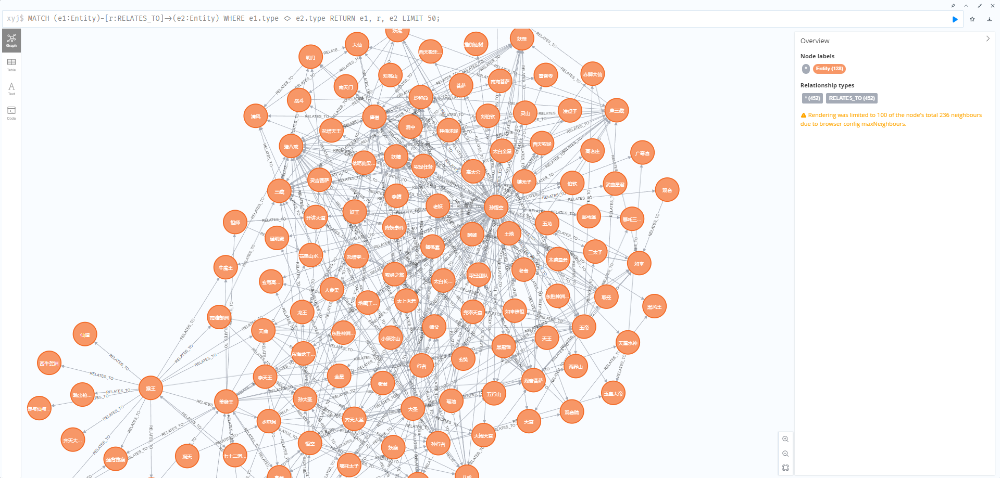
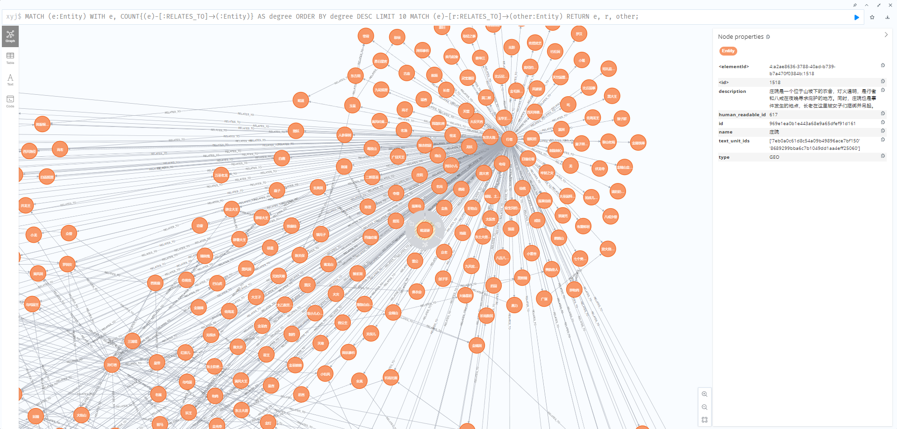
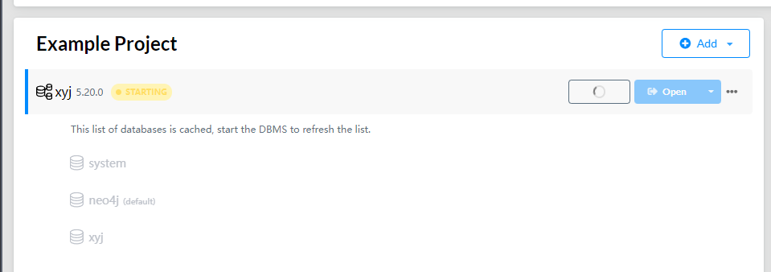
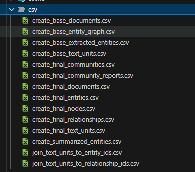
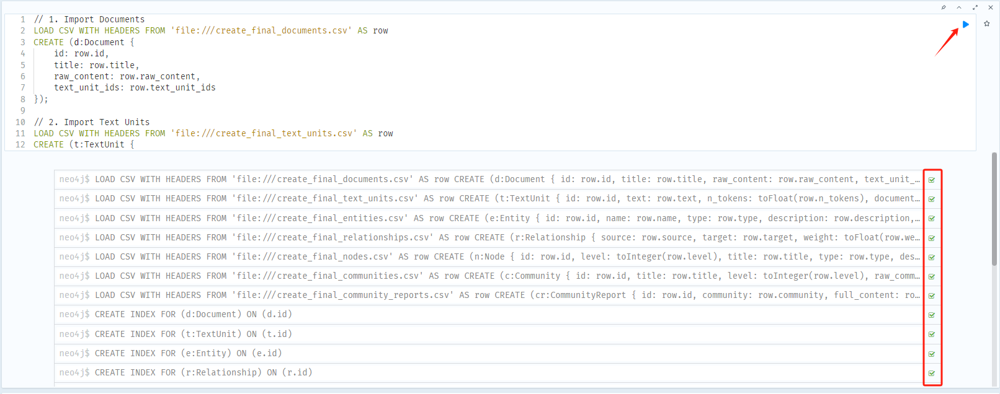

## GraphRag Demo

> 该实现结果
> 1. 使用《西游记》进行Rag
> 1. `chat`使用`deepseek`的`deepseek-chat`模型
> 2. `embedding`使用的是`chatglm`的`embedding-2`模型


### 1. 怎么运行graphrag

1. 执行 `python -m graphrag.index --init  --root . `

   > 会生成`cache、output、prompts`目录


2. 创建input目录， 将需要使用的txt放入

3. 配置`settings.yaml`中的llm和embedding

4. 执行 `python -m graphrag.index --root . `

   最终会在output中生成

   

5. 使用`global_search.ipynb` 运行输出rag结果

---

### 2. 怎么使用`neo4j` 可视化

效果图：



1. 下载neo4j 
https://neo4j.com/download/

2. 启动DBMS



3. 网页访问
http://localhost:7474

4. 将parquet结果转化成csv

使用`transfer.ipynb`脚本



5. 将csv 复制到 neo4j 目录下`relate-data\dbmss\dbms-xxxxx\import` 目录下

6. 执行一下 neo4j 命令进行加载


``` neo4j
// 1. Import Documents
LOAD CSV WITH HEADERS FROM 'file:///create_final_documents.csv' AS row
CREATE (d:Document {
    id: row.id,
    title: row.title,
    raw_content: row.raw_content,
    text_unit_ids: row.text_unit_ids
});

// 2. Import Text Units
LOAD CSV WITH HEADERS FROM 'file:///create_final_text_units.csv' AS row
CREATE (t:TextUnit {
    id: row.id,
    text: row.text,
    n_tokens: toFloat(row.n_tokens),
    document_ids: row.document_ids,
    entity_ids: row.entity_ids,
    relationship_ids: row.relationship_ids
});

// 3. Import Entities
LOAD CSV WITH HEADERS FROM 'file:///create_final_entities.csv' AS row
CREATE (e:Entity {
    id: row.id,
    name: row.name,
    type: row.type,
    description: row.description,
    human_readable_id: toInteger(row.human_readable_id),
    text_unit_ids: row.text_unit_ids
});

// 4. Import Relationships
LOAD CSV WITH HEADERS FROM 'file:///create_final_relationships.csv' AS row
CREATE (r:Relationship {
    source: row.source,
    target: row.target,
    weight: toFloat(row.weight),
    description: row.description,
    id: row.id,
    human_readable_id: row.human_readable_id,
    source_degree: toInteger(row.source_degree),
    target_degree: toInteger(row.target_degree),
    rank: toInteger(row.rank),
    text_unit_ids: row.text_unit_ids
});

// 5. Import Nodes
LOAD CSV WITH HEADERS FROM 'file:///create_final_nodes.csv' AS row
CREATE (n:Node {
    id: row.id,
    level: toInteger(row.level),
    title: row.title,
    type: row.type,
    description: row.description,
    source_id: row.source_id,
    community: row.community,
    degree: toInteger(row.degree),
    human_readable_id: toInteger(row.human_readable_id),
    size: toInteger(row.size),
    entity_type: row.entity_type,
    top_level_node_id: row.top_level_node_id,
    x: toInteger(row.x),
    y: toInteger(row.y)
});

// 6. Import Communities
LOAD CSV WITH HEADERS FROM 'file:///create_final_communities.csv' AS row
CREATE (c:Community {
    id: row.id,
    title: row.title,
    level: toInteger(row.level),
    raw_community: row.raw_community,
    relationship_ids: row.relationship_ids,
    text_unit_ids: row.text_unit_ids
});

// 7. Import Community Reports
LOAD CSV WITH HEADERS FROM 'file:///create_final_community_reports.csv' AS row
CREATE (cr:CommunityReport {
    id: row.id,
    community: row.community,
    full_content: row.full_content,
    level: toInteger(row.level),
    rank: toFloat(row.rank),
    title: row.title,
    rank_explanation: row.rank_explanation,
    summary: row.summary,
    findings: row.findings,
    full_content_json: row.full_content_json
});

// 8. Create indexes for better performance
CREATE INDEX FOR (d:Document) ON (d.id);
CREATE INDEX FOR (t:TextUnit) ON (t.id);
CREATE INDEX FOR (e:Entity) ON (e.id);
CREATE INDEX FOR (r:Relationship) ON (r.id);
CREATE INDEX FOR (n:Node) ON (n.id);
CREATE INDEX FOR (c:Community) ON (c.id);
CREATE INDEX FOR (cr:CommunityReport) ON (cr.id);

// 9. Create relationships after all nodes are imported
MATCH (d:Document)
UNWIND split(d.text_unit_ids, ',') AS textUnitId
MATCH (t:TextUnit {id: trim(textUnitId)})
CREATE (d)-[:HAS_TEXT_UNIT]->(t);

MATCH (t:TextUnit)
UNWIND split(t.document_ids, ',') AS docId
MATCH (d:Document {id: trim(docId)})
CREATE (t)-[:BELONGS_TO]->(d);

MATCH (t:TextUnit)
UNWIND split(t.entity_ids, ',') AS entityId
MATCH (e:Entity {id: trim(entityId)})
CREATE (t)-[:HAS_ENTITY]->(e);

MATCH (t:TextUnit)
UNWIND split(t.relationship_ids, ',') AS relId
MATCH (r:Relationship {id: trim(relId)})
CREATE (t)-[:HAS_RELATIONSHIP]->(r);

MATCH (e:Entity)
UNWIND split(e.text_unit_ids, ',') AS textUnitId
MATCH (t:TextUnit {id: trim(textUnitId)})
CREATE (e)-[:MENTIONED_IN]->(t);

MATCH (r:Relationship)
MATCH (source:Entity {name: r.source})
MATCH (target:Entity {name: r.target})
CREATE (source)-[:RELATES_TO]->(target);

MATCH (r:Relationship)
UNWIND split(r.text_unit_ids, ',') AS textUnitId
MATCH (t:TextUnit {id: trim(textUnitId)})
CREATE (r)-[:MENTIONED_IN]->(t);

MATCH (c:Community)
UNWIND split(c.relationship_ids, ',') AS relId
MATCH (r:Relationship {id: trim(relId)})
CREATE (c)-[:HAS_RELATIONSHIP]->(r);

MATCH (c:Community)
UNWIND split(c.text_unit_ids, ',') AS textUnitId
MATCH (t:TextUnit {id: trim(textUnitId)})
CREATE (c)-[:HAS_TEXT_UNIT]->(t);

MATCH (cr:CommunityReport)
MATCH (c:Community {id: cr.community})
CREATE (cr)-[:REPORTS_ON]->(c);
```